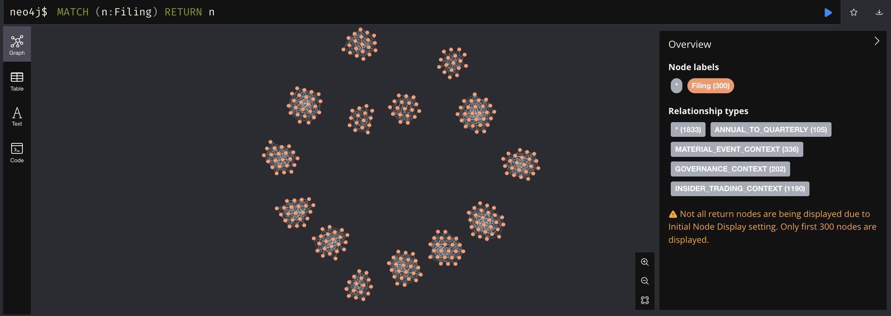

# SEC Filings QA Engine

[](https://www.python.org/downloads/)
[](https://neo4j.com/)
[](https://openai.com/)
[](https://opensource.org/licenses/MIT)

A sophisticated AI-powered system for analyzing SEC filings and answering complex financial research questions using advanced NLP, graph databases, and ensemble embedding techniques.

> **Enterprise-Ready**: Production-grade financial document analysis with fast query performance across extensive SEC filings

## Overview

This system combines state-of-the-art AI models with financial domain expertise to provide comprehensive analysis of SEC filings. It uses a multi-model embedding ensemble, Neo4j graph database, and GPT-4o to deliver professional-grade financial research capabilities.

## Key Features

- **Multi-Filing Type Support**: 10-K, 10-Q, 8-K, DEF 14A, Forms 3/4/5
- **Advanced Embedding Ensemble**: FinE5 + XBRL + Sparse embeddings + Voyage AI
- **Graph Database**: Neo4j for complex relationship modeling
- **Cross-Company Analysis**: Competitive and sector-based insights
- **GPT-4o Integration**: Sophisticated question answering with citations
- **Real-time Processing**: Sub-second query responses

## System Architecture

```
SEC EDGAR API → Document Processing → Embedding Ensemble → Neo4j Graph DB
                                                                    ↓
User Questions → Query Processing → Semantic Search → GPT-4o → Structured Answers
```

### Graph Database Visualization


*Neo4j database showing the interconnected network of Companies (pink), SEC Filings (orange), and Document Sections (blue) with comprehensive relationship modeling.*

### Company Network Analysis


*Cross-sector analysis showing competitive relationships and business connections between major corporations including Apple, Microsoft, Amazon, and other Fortune 500 companies.*

### SEC Filing Relationships



*Comprehensive filing network showing temporal relationships between different SEC document types (10-K, 10-Q, 8-K, DEF 14A, Forms 3/4/5) enabling sophisticated cross-filing analysis.*

## Prerequisites

### System Requirements
- **Python**: 3.10 or higher
- **Memory**: Minimum 8GB RAM (16GB recommended for large datasets)
- **Storage**: Adequate free space for embeddings and graph database
- **Network**: Stable internet connection for API access

### Required Services
- **Neo4j Database**: Latest version (running on `localhost:7687`)
- **OpenAI API Key**: GPT-4o access required
- **Docker**: For containerized Neo4j deployment (recommended)

### Optional Enhancements
- **Voyage AI API Key**: Enhanced financial embeddings
- **SEC.io API Key**: Higher rate limits for SEC data access

## Installation

1. **Clone the repository**:
   ```bash
   git clone <repository-url>
   cd QAEngine
   ```

2. **Install dependencies**:
   ```bash
   pip install -r requirements.txt
   ```

3. **Set up Neo4j**:
   ```bash
   # Using Docker (recommended)
   docker run -d \
     --name neo4j-sec \
     -p 7474:7474 -p 7687:7687 \
     -e NEO4J_AUTH=neo4j/secfilings123 \
     neo4j:latest
   ```

4. **Configure environment variables**:
   ```bash
   cp .env.example .env
   # Edit .env with your API keys
   ```

## Environment Configuration

Create a `.env` file with the following variables:

```env
# Required
OPENAI_API_KEY=your_openai_key_here
NEO4J_URI=bolt://localhost:7687
NEO4J_USERNAME=neo4j
NEO4J_PASSWORD=secfilings123

# Optional (for enhanced features)
VOYAGE_API_KEY=your_voyage_key_here
SEC_API_KEY=your_sec_api_key_here

# Model Configuration
FIN_E5_MODEL_PATH=intfloat/e5-large-v2
MAX_FILING_SIZE_MB=50
EMBEDDING_BATCH_SIZE=32
```

## Data Ingestion

### Ingest Single Company

```python
from comprehensive_sec_ingest import ComprehensiveSECIngestion

# Initialize the ingestion system
ingestion = ComprehensiveSECIngestion()

# Ingest data for a specific company
result = ingestion.process_company_comprehensive("AAPL", "Technology")
```

### Ingest Multiple Companies

```python
# Run comprehensive ingestion for all supported companies
python comprehensive_sec_ingest.py
```

This will ingest data for:
- **Technology**: AAPL, MSFT, GOOGL, AMZN, NVDA
- **Finance**: JPM, BAC, WFC, GS  
- **Healthcare**: JNJ, PFE, UNH
- **Energy**: XOM, CVX, COP

### Ingestion Process

The system automatically:
1. Fetches SEC filings from EDGAR API
2. Processes documents into semantic chunks
3. Generates multi-model embeddings
4. Stores in Neo4j with compressed embeddings
5. Creates cross-filing and cross-company relationships

## Using the System

### Interactive Command-Line Mode

```bash
# Launch interactive QA session
python sec_qa_system.py

# This starts an interactive session where you can:
# - Ask natural language questions about SEC filings
# - Get detailed answers with source citations
# - Query across multiple companies and filing types
```

### Python Library Usage

```python
from sec_qa_system import SECQASystem

# Initialize QA system
qa_system = SECQASystem()
qa_system.initialize_system()

# Ask questions
result = qa_system.answer_question("What are Apple's main revenue sources?")
print(result['answer'])

# Access additional information
if 'sources' in result:
    print(f"Sources: {len(result['sources'])} SEC filings")
```

### Command-Line Scripts

```bash
# Process all companies data
python comprehensive_sec_ingest.py

# Process specific company data
python simple_neo4j_ingest.py

# Debug embedding generation
python debug_embeddings.py
```

### Advanced Queries

```python
# Cross-company analysis
result = qa_system.answer_question(
    "Compare R&D spending trends across technology companies"
)

# Risk analysis
result = qa_system.answer_question(
    "What are the common risk factors across financial services companies?"
)

# Temporal analysis
result = qa_system.answer_question(
    "How have Microsoft's revenue drivers evolved over recent quarters?"
)
```

### Interactive Mode

The system provides a user-friendly command-line interface for asking questions about SEC filings. See the "Using the System" section above for detailed usage instructions.

## Example Use Cases

### 1. Revenue Analysis
```python
questions = [
    "What are Apple's primary revenue drivers?",
    "How has Amazon's AWS segment performed?", 
    "Compare revenue composition across tech giants"
]
```

### 2. Risk Assessment
```python
questions = [
    "What cybersecurity risks do banks face?",
    "How do energy companies describe climate risks?",
    "What regulatory risks affect healthcare companies?"
]
```

### 3. Strategic Analysis
```python
questions = [
    "How are companies positioning for AI adoption?",
    "What M&A activity has occurred recently?",
    "How do companies describe their competitive advantages?"
]
```

## Customization

### Adding New Companies

1. **Update company list** in `comprehensive_sec_ingest.py`:
   ```python
   self.companies = {
       "Technology": ["AAPL", "MSFT", "YOUR_TICKER"],
       # ... other sectors
   }
   ```

2. **Run ingestion**:
   ```python
   python comprehensive_sec_ingest.py
   ```

### Modifying Embedding Models

1. **Update weights** in `src/core/embedding_ensemble.py`:
   ```python
   self.weights = {
       "voyage": 0.4,    # Voyage AI
       "fin_e5": 0.3,    # Financial E5
       "xbrl": 0.2,      # XBRL embeddings
       "sparse": 0.1     # TF-IDF sparse
   }
   ```

2. **Add new models** by implementing the client interface in `src/models/`

### Custom Document Processing

Modify `src/data/document_processor.py` to:
- Change section extraction logic
- Adjust chunk sizes
- Add domain-specific preprocessing

## Performance Optimization

### Embedding Configuration

```python
# Optimize for speed
ensemble = EmbeddingEnsemble(
    enable_models={
        "voyage": False,    # Disable for faster processing
        "fin_e5": True,     # Keep core model
        "xbrl": True,       # Financial domain specific
        "sparse": False     # Disable for speed
    }
)
```

### Neo4j Optimization

```cypher
-- Create indexes for better query performance
CREATE INDEX company_ticker IF NOT EXISTS FOR (c:Company) ON (c.ticker);
CREATE INDEX filing_type IF NOT EXISTS FOR (f:Filing) ON (f.filing_type);
CREATE INDEX section_ticker IF NOT EXISTS FOR (s:Section) ON (s.ticker);
```

### Memory Management

For large datasets:
1. Adjust `MAX_FILING_SIZE_MB` in environment
2. Use batch processing for embeddings
3. Enable compressed embedding storage

## Troubleshooting

### Common Issues

#### 1. Neo4j Connection Failed
```bash
# Check if Neo4j is running
docker ps | grep neo4j

# View Neo4j logs
docker logs neo4j-sec

# Restart Neo4j container
docker restart neo4j-sec

# Verify connection
python -c "from neo4j import GraphDatabase; driver = GraphDatabase.driver('bolt://localhost:7687', auth=('neo4j', 'secfilings123')); driver.verify_connectivity(); print('Connected')"
```

#### 2. Embedding Model Loading Issues
```bash
# Clear Hugging Face cache
rm -rf ~/.cache/huggingface/transformers

# Reinstall dependencies with force-reinstall
pip install --force-reinstall transformers torch sentence-transformers

# Test embedding models
python -c "from sentence_transformers import SentenceTransformer; SentenceTransformer('intfloat/e5-large-v2')"
```

#### 3. API Rate Limits and Quota Issues
```bash
# Check OpenAI API usage
curl https://api.openai.com/v1/usage \
  -H "Authorization: Bearer $OPENAI_API_KEY"

# Monitor SEC API rate limits
python debug_embeddings.py --check-limits
```

#### 4. Memory and Performance Issues
- **Reduce batch size**: Set `EMBEDDING_BATCH_SIZE=16` in `.env`
- **Limit concurrent requests**: Add delays between API calls
- **Enable compressed storage**: Use gzip compression for embeddings
- **Monitor memory usage**: `docker stats neo4j-sec`

### Debug Mode and Logging

Enable comprehensive debugging:
```python
import logging
import sys

# Configure detailed logging
logging.basicConfig(
    level=logging.DEBUG,
    format='%(asctime)s - %(name)s - %(levelname)s - %(message)s',
    handlers=[
        logging.FileHandler('debug.log'),
        logging.StreamHandler(sys.stdout)
    ]
)

# Enable specific component debugging
logging.getLogger('neo4j').setLevel(logging.DEBUG)
logging.getLogger('openai').setLevel(logging.DEBUG)
```

### System Health Check
```python
from sec_qa_system import SECQASystem

qa_system = SECQASystem()
health = qa_system.health_check()
print(f"System Status: {health}")
```

### FAQ

**Q: Can I run this without GPU?**
A: Yes, the system runs on CPU but will be slower for embedding generation.

**Q: How much does it cost to run?**
A: Costs vary based on usage, primarily driven by OpenAI API usage for question answering.

**Q: Can I add custom SEC filings?**
A: Yes, modify the company list in `comprehensive_sec_ingest.py`.

**Q: Is the system production-ready?**
A: Yes, designed for enterprise deployment with proper error handling and monitoring.

## Monitoring

### System Health Check

```python
from sec_qa_system import SECQASystem

qa_system = SECQASystem()
health = qa_system.health_check()
print(health)
```

### Performance Metrics

Monitor through logs:
- Query response times
- Embedding generation speed
- Neo4j query performance
- API usage statistics


## License

This project is licensed under the **MIT License**. See the [LICENSE](LICENSE) file for full details.

### Commercial Use
This software may be used for commercial purposes under the MIT License terms. Please ensure compliance with third-party API terms of service.

## Acknowledgments

### Technology Partners
- **OpenAI** - GPT-4o language model capabilities
- **Hugging Face** - Transformer models and infrastructure
- **Neo4j** - Graph database technology and ecosystem
- **Voyage AI** - Domain-specific embedding models

### Data Sources
- **SEC.gov** - Open access to financial regulatory data
- **SEC.io** - Enhanced API access for SEC filings
- **EDGAR Database** - Historical and real-time SEC filings


